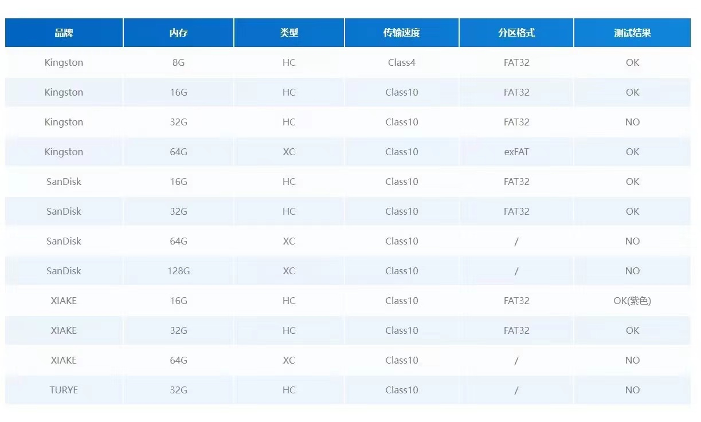
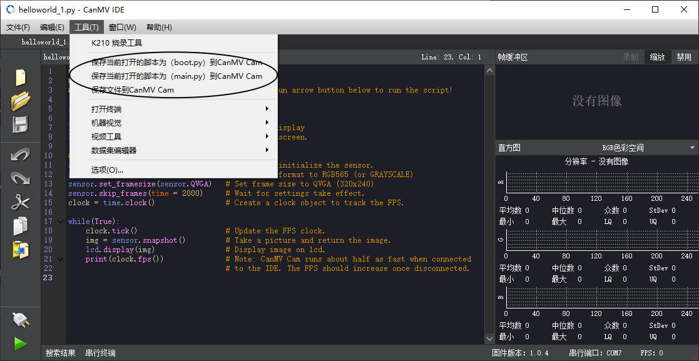

CanMV 常见问题汇总（FAQ）
===============
本文整理了 CanMV 及相关工具在使用过程中可能会遇到的常见问题，希望它也能帮助到您。  
如果您在使用中遇到问题，也可加入如下互助交流 QQ 群,与群友一起交流相关经验：  
  

## 1. 你们的芯片供应正常吗？  
芯片正常供应中。  
如果需要购买芯片，可通过嘉楠官网[合作咨询](https://canaan-creative.com/product/kendryteai)提交表单联系相应的商务人员进行对接，或发送合作邮件至 [salesAI@canaan-creative.com](mailto://salesAI@canaan-creative.com)描述您的项目和需求详情。  

## 2. 为什么我的 TF/Micro SD 卡不能正常识别？  
当遇到 TF/Micro SD 读取问题时，可按如下步骤逐步排查：  
* 首先确认 SD 卡能否在电脑上正常读取使用。如果电脑端也无法使用，则 SD 卡已损坏，请更换一张。
* 重新格式化 SD 卡，将其格式化为 FAT32 格式，再尝试使用。
* 检查 SD 卡分区表，查看分区表类型是否为 MBR，如果是 GPT 类型，则需要转换为 MBR 类型。推荐使用 [DiskGenius](https://www.diskgenius.cn/) 软件进行转换。
* SD 卡规范包含 SD 和 SPI 两种协议。K210 硬件使用 SPI 协议进行读取，有些卡不兼容 SPI 协议，会造成 SD 卡读写失败。遇到这种情况，可以再找一张其它类型的卡做交叉测试。***请尽量采购正规厂商的卡***。  

## 3. TF/Micro SD 卡支持多大容量？
测试过可以支持 **1TB** 的卡。  
如下 SD 卡型号有验证正常使用：  


## 4. 为什么 TF 卡格式没有问题，但是无法读取，提示挂载失败？
请使用如下代码进行重新挂载：  
```python
from machine import SDCard
SDCard.remount()
```
使用如下代码检查是否挂载成功：  
```python
def sd_check():
    import os
    try:
        os.listdir("/sd/.")
    except Exception as e:
        return False
    return True
print(sd_check())
```
## 5. 我执行代码遇到报错：OSEerror: [Errno 2] ENOENT
遇到这个错误提示，一般是因为要读取的目标文件路径有错。如果这个文件路径是在 SD 卡上，请检查 SD 卡是否挂载正常。  
可使用如下代码判断内存是否挂载上，如果挂载不上会返回 False。卡不兼容，或者是卡没有格式化好，都可能会造成 SD 卡挂载失败。
```python
def sd_check():
    import os
    try:
        os.listdir("/sd/.")
    except Exception as e:
        return False
    return True
print(sd_check())
```

## 6. 我可以自行换摄像头吗？当前支持哪些 sensor?
如果需要更换 sensor，请检查硬件原理图，确认 sensor 模组使用的电平与开发板相应引脚输出电压一致。  
目前固件支持如下 sensor:
* OV2640/OV3660/OV5640/OV5642/OV7740
* GC0328/GC2145/GC0308

## 7. 为什么连接 CanMV IDE 后， 显示帧率降低了很多？
由于 K210 芯片没有原生 USB 接口，因此使用串口与 IDE 通信，速度不如 USB 设备快，因此会影响传输帧率。关闭 IDE 的摄像头预览可以提升帧率。  

## 8. 为什么 CanMV IDE 上预览的摄像头图像很模糊？
原因同上，因为兼顾数据传输速度的原因，我们对图片进行了压缩，并且默认压缩率较大，因此 IDE 上显示的图像没那么清楚。如果需要清晰的图像请在开发板的屏幕上看，或者保存成图片传到电脑查看。
IDE 的图像预览功能主要是给教学和演示使用，建议平时使用屏幕查看。

如果需要，您可以使用如下代码来自定义预览图质量：  
```python
sensor.set_jb_quality(95)
```
这样就将预览图的质量设置为了 95%， 但是相应的显示帧率会有明显降低。

## 9. IDE 保存文件功能如何使用？
### 文件保存在哪里
如果开发板有插入 SD 卡，并正常识别（`sd_check()`返回`True`）,则默认保存位置为 SD 卡，如果没有 SD 卡，则默认保存到 flash 内部文件系统。  
选择[保存文件到CanMV Cam]菜单，并输入相应的文件系统完整路径，例如”/flash/test_1.py“，您可将文件保存至文件系统指定位置。 

### 无法点击保存按钮？
通常由以下两种原因引起：  
* 需要目标板首先连接到 IDE，才能使用文件保存功能  
* 如果当前编辑器没有打开文件，则保存 main.py/boot.py 这两个选项为灰色，不可选择


### 保存文件到 CanMV Cam
  
点击 `打开` 浏览并选择要保存到 `CanMV Cam` 的文件，则会将此文件传输至开发板指定路径中。 用户需要指定要保存路径，例如输入 `/sd/test.py`，会将文件保存到 SD 卡中，文件名为 `test.py`。如果输入 `/flash/test.bin`， 则将文件保存到 flash 内部，文件名为 `test.bin`。如果不指定路径，则自动解析文件名(不支持中文文件名)，并保存到当前系统目录下(有 SD 默认保存 /sd, 没有则默认保存到 /flash)。   
注意： 如果您要保存的文件非常大，使用串口连接时，有时会因为串口连接的不稳定性，造成文件保存失败。如果您遇到此种问题，建议使用 SD 卡读卡工具直接写入到卡中，或者通过`K210烧录工具`指定偏移地址，将文件烧录到 flash 的目标处。  

## 10. K210 烧录工具如何使用？
### 烧录固件
通过点击 CanMV IDE 菜单的[工具] -> [K210烧录工具]，可以调出烧录工具界面。

点击[浏览]选择需要烧录的固件，设定好要烧录偏移地址(默认为0x000000)，点击[下载]按钮，即可开始固件下载。  
此工具同时也支持`kfpkg`格式文件的烧录下载。  

### 擦除 Flash
CanMV 固件的 Flash 布局，分为两个区域，一个是固件区域，一个是文件系统区域。有时候需要擦除 flash，您可以点击[切换到擦除]按钮，切换至 flash 擦除界面。


### 部分擦除
在”模式“下拉框中选择[部分擦除]，用户可以手动指定擦除起始地址以及要擦除的长度，直接将目标地址和长度填入至相应的栏位即可。    
烧录工具也内置一些地址模板，你可以选择`模板`下拉菜单里的相应配置，再点击`加载模板`，则工具会自动载入模板内置的起始地址以及长度，方便用户操作。  
当您发现系统运行不正常时，可尝试通过擦除文件系统，恢复至初始状态，一般可解决大多数问题。  

### 全片擦除
在”模式“下拉框中选择[全片擦除]，则会将整片 Flash 擦除。  

### 烧录/擦除报错
如果您在下载过程中遇到报错，通常是因为串口设置不正确引起的。请首先确认串口是否选择正确，然后尝试降低工作波特率（115200），看是否能够正常下载。  
